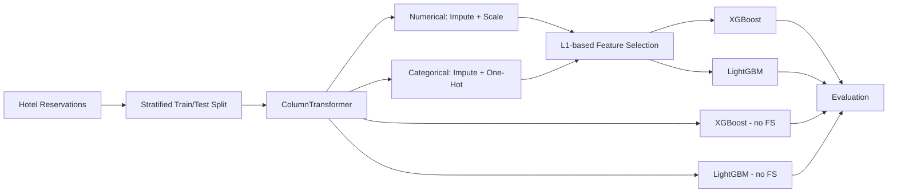

# Hotel Booking Cancellation Prediction

> A leakage-aware tabular ML study for predicting reservation cancellation risk and comparing gradient-boosting pipelines with and without feature selection.

## Business problem

Hotel cancellations create uncertainty around room availability, staffing, revenue forecasting, and inventory planning. This project models cancellation risk from reservation attributes so that a business can identify higher-risk bookings earlier and make more informed operational decisions.

The work intentionally focuses on **pipeline quality and evaluation discipline**, not just a single accuracy score.

## Key results

| Pipeline | Accuracy | Precision | Recall | F1 | ROC-AUC |
|---|---:|---:|---:|---:|---:|
| **XGBoost + feature selection** | **90.31%** | 87.37% | 82.33% | **84.77%** | 95.87% |
| LightGBM + feature selection | 90.23% | **87.50%** | 81.87% | 84.59% | 88.08% |
| XGBoost | 90.19% | 86.98% | **82.37%** | 84.62% | **95.93%** |
| LightGBM | 90.23% | 87.40% | 81.99% | 84.61% | 88.12% |

**Selected pipeline:** XGBoost + feature selection, because it produced the strongest accuracy/F1 balance in the notebook. The non-feature-selected XGBoost model produced the highest ROC-AUC.

## ML workflow



## Leakage prevention

Preprocessing is fitted **inside scikit-learn pipelines after the train/test split**, so imputers, scaling, encoding, and model-side transformations learn only from training data. This is one of the most important design choices in the notebook.

## Feature engineering & selection

- Numerical features: median imputation + standardization.
- Categorical features: most-frequent imputation + one-hot encoding.
- Feature selection: `SelectFromModel` using L1-style logistic-regression sparsity.
- Fixed random seed for reproducibility.

## Models compared

- XGBoost with feature selection
- LightGBM with feature selection
- XGBoost without feature selection
- LightGBM without feature selection

The comparison asks a practical modeling question: **can a smaller feature set preserve predictive quality while reducing model complexity?**

## Evaluation

The project reports:

- Accuracy
- Precision
- Recall
- F1-score
- ROC-AUC
- Confusion matrix
- ROC curve

A 0.5 probability threshold is used for binary predictions in the notebook.

## Tech stack

`Python` · `pandas` · `NumPy` · `scikit-learn` · `XGBoost` · `LightGBM` · `Matplotlib` · `Jupyter / Colab`

## Run the notebook

```bash
git clone https://github.com/omarbazooka/Final-Hotel-Reservation-Project.git
cd Final-Hotel-Reservation-Project
pip install numpy pandas matplotlib scikit-learn xgboost lightgbm jupyter
jupyter notebook
```

The current notebook references the dataset through a Google Drive path, so update the data path when running locally.

## From model metric to business impact

A production version should not stop at ROC-AUC. The next useful step is to define the **cost of false positives vs. false negatives** and tune the decision threshold around a hotel-specific objective such as expected cancellation cost, overbooking risk, or recovery revenue. That would turn the model from a technical benchmark into a measurable business decision system.

## Next engineering improvements

- Replace the current XGBoost regressor wrapper with `XGBClassifier` for clearer classifier semantics.
- Add cross-validation and confidence intervals.
- Add reproducible tuning code and experiment tracking.
- Add SHAP-based feature explanations.
- Persist the trained pipeline and expose it through an API.
- Add threshold optimization against an explicit business-cost function.
- Add automated tests for preprocessing and inference.

## Author

**Omar Ahmed** — AI Engineer  
[GitHub](https://github.com/omarbazooka) · [LinkedIn](https://www.linkedin.com/in/omer-ahmed-bahaa/)
